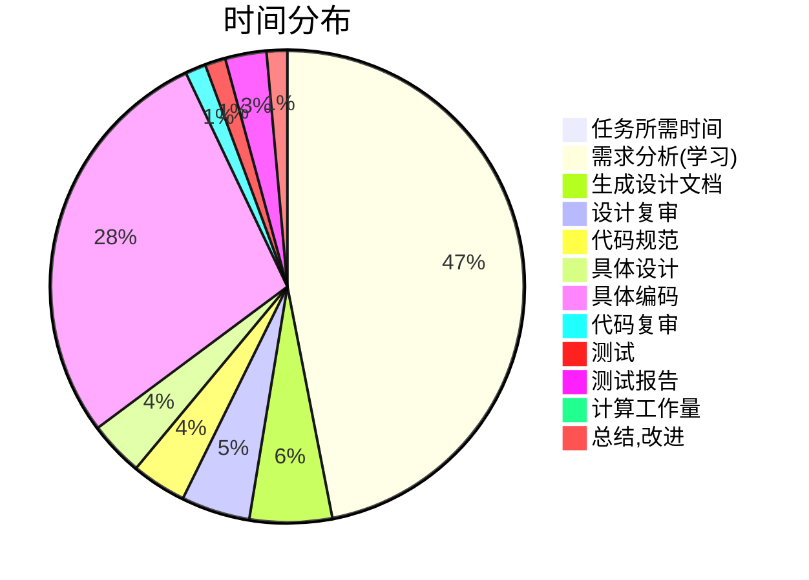

# 1.1Github链接

[ljy-521/ljy at 032002521 (github.com)](https://github.com/ljy-521/ljy/tree/032002521)

---
# 一、PSP表格

| Personal Software Process Stages         | 预估耗时 （分钟） | 实际耗时 （分钟） |
| ---------------------------------------- | ----------------- | ----------------- |
| 计划                                     | 20                | 20                |
| · 估计这个任务需要多少时间               | 20                | 20                |
| 开发                                     | 35h               | 60h+              |
| · 需求分析 (包括学习新技术)              | 15h               | 6天               |
| · 生成设计文档                           | 5h                | 4h                |
| · 设计复审                               | 5h                | 3h                |
| · 代码规范 (为目前的开发制 定合适的规范) | 1h                | 2h                |
| · 具体设计                               | 3h                | 2h                |
| · 具体编码                               | 4h                | 3天               |
| · 代码复审                               | 1h                | 1h                |
| · 测试（自我测试，修改代 码，提交修改）  | 1h                | 1天               |
| 报告                                     | 7h                | 3.33h             |
| · 测试报告                               | 5h                | 2h                |
| ·计算工作量                              | 1h                | 20                |
| ·事后总结, 并提出过程改进 计划           | 1h                | 1h                |
| ·合计                                    | 42.33h            | 16天              |




# 二、任务要求的实现


## 项目设计与技术栈

### （2.1.1） 项目设计

> - [x] 整体思路分析+耗时预估
>
>   1. 明确题意，明白本次任务重点在哪里
>   2. 明确要学习的新技术，学习方向与目标
>   3. 对各个项目时间的分配有一个较为合理的规划
>
> - [x] 知识预备存储
>
>   1. 学习python基本语法
>   2. 进一步了解python函数与返回值，尝试调用函数
>   3. 了解爬取网页所需的基本模块（csv,request等），包括对应函数的使用方法
>   4. 学习正则表达式匹配
>   5. 学习动态cookie与反爬技术
>   6. 学习jupyte相关可视化绘图语法
>
> - [x] 实战演练
>
>   1. 爬取卫健委疫情通报版面全部数据
>   2. 两次正则匹配清洗数据
>   3. 导入excel并生成可视化
>
> - [x] 总结与反思
>
>   
>
> |   渠道/过程    | 整体思路分析+耗时预估 | 知识预备存储 | 实战演练 | 总结与反思 |
> | :------------: | :-------------------: | :----------: | :------: | :--------: |
> | 看b站教学视频  |                       |      ✔       |    ✔     |            |
> | csdn+百度+...  |           ✔           |      ✔       |    ✔     |            |
> | 和同学交流探讨 |                       |      ✔       |    ✔     |            |
> |  自己认真思考  |           ✔           |      ✔       |    ✔     |     ✔      |
>
> 
>
### （2.1.2） 技术栈

##### 爬虫部分：

- [x] ###### python

  - [requests](https://blog.csdn.net/qq_41286824/article/details/125481563?ops_request_misc=%257B%2522request%255Fid%2522%253A%2522166360156616782412570090%2522%252C%2522scm%2522%253A%252220140713.130102334..%2522%257D&request_id=166360156616782412570090&biz_id=0&utm_medium=distribute.pc_search_result.none-task-blog-2~all~sobaiduend~default-2-125481563-null-null.142^v47^pc_rank_34_queryrelevant25,201^v3^add_ask&utm_term=requests&spm=1018.2226.3001.4187)
  - [csv]([(89条消息) csv文件介绍与使用_偷懒的肥猫的博客-CSDN博客_csv](https://blog.csdn.net/weixin_45135767/article/details/108697336?ops_request_misc=%7B%22request%5Fid%22%3A%22166360181216800182136037%22%2C%22scm%22%3A%2220140713.130102334..%22%7D&request_id=166360181216800182136037&biz_id=0&utm_medium=distribute.pc_search_result.none-task-blog-2~all~top_click~default-2-108697336-null-null.142^v47^pc_rank_34_queryrelevant25,201^v3^add_ask&utm_term=csv&spm=1018.2226.3001.4187))
  - [playwright_stealth](https://blog.csdn.net/weixin_38235865/article/details/123016440?ops_request_misc=%257B%2522request%255Fid%2522%253A%2522166360185816782248599671%2522%252C%2522scm%2522%253A%252220140713.130102334..%2522%257D&request_id=166360185816782248599671&biz_id=0&utm_medium=distribute.pc_search_result.none-task-blog-2~all~baidu_landing_v2~default-1-123016440-null-null.142^v47^pc_rank_34_queryrelevant25,201^v3^add_ask&utm_term=playwright_stealth&spm=1018.2226.3001.4187)
  - [lxml](https://blog.csdn.net/kikaylee/article/details/56842194?ops_request_misc=%257B%2522request%255Fid%2522%253A%2522166360190216782417081735%2522%252C%2522scm%2522%253A%252220140713.130102334..%2522%257D&request_id=166360190216782417081735&biz_id=0&utm_medium=distribute.pc_search_result.none-task-blog-2~all~sobaiduend~default-2-56842194-null-null.142^v47^pc_rank_34_queryrelevant25,201^v3^add_ask&utm_term=lxml&spm=1018.2226.3001.4187)
  - [time](https://blog.csdn.net/u012175089/article/details/62044335?ops_request_misc=%257B%2522request%255Fid%2522%253A%2522166360193616782390519322%2522%252C%2522scm%2522%253A%252220140713.130102334..%2522%257D&request_id=166360193616782390519322&biz_id=0&utm_medium=distribute.pc_search_result.none-task-blog-2~all~baidu_landing_v2~default-5-62044335-null-null.142^v47^pc_rank_34_queryrelevant25,201^v3^add_ask&utm_term=time&spm=1018.2226.3001.4187)
  - [re](https://blog.csdn.net/guo_qingxia/article/details/113979135?ops_request_misc=%257B%2522request%255Fid%2522%253A%2522166360196316781432984148%2522%252C%2522scm%2522%253A%252220140713.130102334..%2522%257D&request_id=166360196316781432984148&biz_id=0&utm_medium=distribute.pc_search_result.none-task-blog-2~all~top_positive~default-1-113979135-null-null.142^v47^pc_rank_34_queryrelevant25,201^v3^add_ask&utm_term=re&spm=1018.2226.3001.4187)
  - [playwright.sync-api](https://blog.csdn.net/wangmcn/article/details/125712860?ops_request_misc=%257B%2522request%255Fid%2522%253A%2522166360199116782390590985%2522%252C%2522scm%2522%253A%252220140713.130102334.pc%255Fall.%2522%257D&request_id=166360199116782390590985&biz_id=0&utm_medium=distribute.pc_search_result.none-task-blog-2~all~first_rank_ecpm_v1~pc_rank_34-1-125712860-null-null.142^v47^pc_rank_34_queryrelevant25,201^v3^add_ask&utm_term=playwright.sync-api&spm=1018.2226.3001.4187)

#####  可视化部分：

- [x] **jupyter**
  - [pandas](https://blog.csdn.net/yiyele/article/details/80605909?ops_request_misc=%257B%2522request%255Fid%2522%253A%2522166360251216782417098128%2522%252C%2522scm%2522%253A%252220140713.130102334..%2522%257D&request_id=166360251216782417098128&biz_id=0&utm_medium=distribute.pc_search_result.none-task-blog-2~all~top_positive~default-1-80605909-null-null.142^v47^pc_rank_34_queryrelevant25,201^v3^add_ask&utm_term=pandas&spm=1018.2226.3001.4187)
  - [pyecharts](https://blog.csdn.net/weixin_52720197/article/details/114729789?ops_request_misc=&request_id=&biz_id=102&utm_term=pyecharts&utm_medium=distribute.pc_search_result.none-task-blog-2~all~sobaiduweb~default-0-114729789.142^v47^pc_rank_34_queryrelevant25,201^v3^add_ask&spm=1018.2226.3001.4187)
  - [matplotlib](https://blog.csdn.net/qq_34859482/article/details/80617391?ops_request_misc=%257B%2522request%255Fid%2522%253A%2522166360255916782395395455%2522%252C%2522scm%2522%253A%252220140713.130102334..%2522%257D&request_id=166360255916782395395455&biz_id=0&utm_medium=distribute.pc_search_result.none-task-blog-2~all~top_positive~default-1-80617391-null-null.142^v47^pc_rank_34_queryrelevant25,201^v3^add_ask&utm_term=matplotlib&spm=1018.2226.3001.4187)

## 爬虫与数据处理

###  **（2.2.1）爬取卫健委网站思路**


>```mermaid
>
>graph LR
>id((爬取卫健委网站)) --> A(解析html得到每天的链接)
>id((爬取卫健委网站)) --> B(打开提取到的链接进行爬取)
>id((爬取卫健委网站)) --> C(爬取url)
>```
>
>- [x] def get_html(html)  //解析html得到每天的链接
>
>  ```python
>  def get_html(html):
>      '''解析html得到每天的链接'''
>      response = etree.HTML(html)
>      '''选择"zxxx_list"的ul下的li'''
>      tr = ('//ul[@class="zxxx_list"]/li')
>      '''item依次表示tr中的一个元素，遍历'''
>      for item in tr:
>          '''网址拼接，xpath定位a标签中指定超链接目标的URL'''
>          item_url = 'http://www.nhc.gov.cn' + item.xpath('./a/@href')[0]
>          '''打印'''
>          print(item_url)
>          '''xpath定位元素,在当前节点下面进行选择'''
>          data_time = item.xpath('./span/text()')
>          with open('链接.csv', 'a+', encoding='utf-8-sig', newline='') as f:
>              f = csv.writer(f)
>              '''单行写入，将一个列表全部写入csv的同一行'''
>              f.writerow([item_url] + [data_time])
>  ```
>
>  
>
>- [x] def get_item_url()   //打开提取到的链接进行爬取，p标签里面就是他每一次通报的一个内容，再保存成一个excel数据
>
>  ```python
>  def get_item_url():
>      '''打开提取到的链接进行爬取'''
>      cd = csv.reader(open('链接.csv', 'r', encoding='utf-8'))
>      for item in cd:
>          '''将文本中的去除零宽字符替换成空格'''
>          item_url = item[0].replace('', '')
>          '''打印出item_url内容'''
>          print(item_url)
>          '''获取页面源代码'''
>          html = get_urls(item_url)
>          '''解析字符串格式的HTML文档对象，将传进去的字符串转变成_Element对象,以便使用xpath函数'''
>          item_response = etree.HTML(html)
>          '''从任意层级开始查找div,若满足id具有xw_box属性，再查找其子节点，并赋予格式'''
>          p = item_response.xpath('//div[@id="xw_box"]/p[@style="text-align: justify; line-height: 1.5; text-indent: 2em; font-family: 仿宋,仿宋_GB2312; font-size: 16pt; -ms-text-justify: inter-ideograph;"]')
>          if p == []:
>              p = item_response.xpath('//div[@id="xw_box"]/p')
>          txt_list = []
>          for p_s in p:
>              '''该标签下（包括其中包含的子标签）的所有文本'''
>              txt = p_s.xpath('.//text()')
>              if txt != [] and txt != ['\n']:
>                  '''保存'''
>                  txt_list.append(''.join(txt))
>                  print(txt)
>          '''导入爬取数据，输出文件对象'''
>          with open('疫情数据xin.csv', 'a+', encoding='utf-8-sig', newline='') as f:
>              f = csv.writer(f)
>              f.writerow(item + txt_list)
>  ```
>
>- [x] def get_urls(url)      //爬取url，模拟浏览器读取，返回网页源码到这里解析
>
>  ```python
>  def get_urls(url):
>      '''爬取url'''
>      '''导入了sync_playwright方法,返回的是一个PlaywrightContextManager对象,将其赋值为变量 p'''
>      with sync_playwright() as p:
>          '''launch 方法返回的是一个 Browser 对象，我们将其赋值为 browser 变量'''
>          browser = p.chromium.launch()
>          '''调用 browser 的 new_page 方法，相当于新建了一个选项卡，返回的是一个 Page 对象，将其赋值为 page'''
>          page = browser.new_page()
>          stealth_sync(page)
>          '''goto加载某个页面'''
>          page.goto(url)
>          '''挂起(等待)当前线程的执行'''
>          time.sleep(10)
>          '''页面内容'''
>          html = page.content()
>          '''关闭当前窗口'''
>          browser.close()
>          return html
>  ```
***


### **（2.2.1）数据清洗**

***


>```mermaid
>
>graph LR
>id((数据清洗并导入excel)) --> A(将原始的文件清洗换行符等)
>id((数据清洗并导入excel))  --> B(csv创建表头及字典)
>id((数据清洗并导入excel))  --> C(正则表达式第一次数据统计)
>id((数据清洗并导入excel))  --> D(正则表达式第二次数据统计并导入excel)
>C(正则表达式第一次数据统计) --> E>每日本土新增]
>C(正则表达式第一次数据统计) --> F>无症状感染者]
>C(正则表达式第一次数据统计) --> G>省份无症状]
>C(正则表达式第一次数据统计) --> S>省份新增]
>D(正则表达式第二次数据统计并导入excel) --> Z>继续提取省份后面的数字]
>```
>- [x] 替换换行，格式符号等
>- [x] 定义excel横纵坐标
>- [x] 数据统计
>
>```python
>#统计数据
>cd = csv.reader(open('清洗后疫情数据.csv', 'r', encoding='utf-8'))
>for item in cd:
>txt_time = item[1]
>#txt是返回被子字符串连接的字符串。
>txt = ''.join(item)
>#每天本土新增
>dict['时间'] = item[1]
># 新增确诊病例 按正则表达式在txt进行寻找 re.S将这个字符串看做整体
>newConfirmed = re.search('\u65b0\u589e\u786e\u8bca.*?\u4f8b(\d*)\u4f8b', txt, re.S)
>#无症状感染
>Confirmed = re.search('31个省（自治区、直辖市）和新疆生产建设兵团报告新增无症状感染者(\d*)例', txt, re.S)
>#省份无症状
>wuzhengzhuang_s = ''.join(re.findall('报告新增无症状感染者.*）。当', txt))
>#省份新增
>new_data = ''.join(re.findall('本土病例\d*例（(.*?)）', item[2]))
>```
>
>- [x] 匹配以某某某开头或某某某结尾进行查找

***


## 数据统计接口部分的性能改进

>- ##### 卫健委爬取文件测试
>
>  - [x] 消耗最大
>
>  
>
>- ##### 数据清洗测试
>
>  
>
>- ##### 百度热点话题测试
>
>  
>
>- [`cProfile`模块](https://docs.python.org/3.7/library/profile.html#module-cProfile)收集有关Python程序执行时间的统计信息。 它可以报告从整个应用程序到单个语句或表达式的所有内容，其可输出可用的排序选项使我们可以找出程序中潜在的性能瓶颈。
>
>  - 通过`ncalls`列可以最频繁地调用哪些函数
>
>  - 通过`tottime`列来花费程序的大部分时间执行功能
>
>  - 消耗最大的函数：
>
>    ```python
>    def get_html(html):
>        '''解析html得到每天的链接'''
>        response = etree.HTML(html)
>        '''选择"zxxx_list"的ul下的li'''
>        tr = ('//ul[@class="zxxx_list"]/li')
>        '''item依次表示tr中的一个元素，遍历'''
>        for item in tr:
>            '''网址拼接，xpath定位a标签中指定超链接目标的URL'''
>            item_url = 'http://www.nhc.gov.cn' + item.xpath('./a/@href')[0]
>            '''打印'''
>            print(item_url)
>            '''xpath定位元素,在当前节点下面进行选择'''
>            data_time = item.xpath('./span/text()')
>            with open('链接.csv', 'a+', encoding='utf-8-sig', newline='') as f:
>                f = csv.writer(f)
>                '''单行写入，将一个列表全部写入csv的同一行'''
>                f.writerow([item_url] + [data_time])
>    ```
## 每日热点的实现思路

> ```flow
> flowchat
> st=>start: 目的：爬取百度疫情热点内容
> oa=>operation: 制造header
> ob=>operation: 反爬进行4次重试
> oc=>operation: 爬取获取信息
> od=>end: 完成爬取数据，导入excel
> st->oa
> oa->ob
> ob->oc
> oc->od
> 
> ```
> - [x] 学习头文件
>
>   ```python
>   headers = {
>       #指定客户端能够接受的内容类型
>       'Accept':'text/html,application/xhtml+xml,application/xml;q=0.9,image/avif,image/webp,image/apng,*/*;q=0.8,application/signed-exchange;v=b3;q=0.9',
>       #请求头允许客户端声明它可以理解的自然语言，以及优先选择的区域方言 最佳语言为中文-中国（默认权重为1），其次为中文，权重为0.9
>       'Accept-Language':'zh-CN,zh;q=0.9',
>       #连接状态
>       'Connection':'keep-alive',
>       #当浏览器向web服务器发送请求的时候，一般会带上Referer，告诉服务器我是从哪个页面链接过来的
>       'Referer':'https://www.baidu.com',
>       #表示请求的目的地，即以document方式获取的数据
>       'Sec-Fetch-Dest':'document',
>       #表示这是一个浏览器的页面切换请求(request)，navigate请求仅在浏览器切换页面时创建，该请求应该返回HTML
>       'Sec-Fetch-Mode':'navigate',
>       #表示一个请求发起者的来源与目标资源来源之间的关系，此处表示，发起和目标站点源完全一致
>       'Sec-Fetch-Site':'same-origin',
>       #导航请求由用户激活以外的原因触发
>       'Sec-Fetch-User':'?1',
>       #可以把所属本站的所有 http 连接升级为 https 连接
>       'Upgrade-Insecure-Requests':'1',
>       #最重要的请求头信息之一；一般可以直接复制，对于一些变化的可以选择构造
>       'cookie':'BAIDUID=1683EDF66AE0E28A51DBEB4EB5D063DC:FG=1; BIDUPSID=1683EDF66AE0E28A51DBEB4EB5D063DC; PSTM=1661661840; BD_UPN=123253; newlogin=1; BDORZ=B490B5EBF6F3CD402E515D22BCDA1598; BDUSS=VpnckYzN0tTVDY1NWxUZ28tM2laRGJqRDY2MkVJM0ZEakhtQ3VFVzFTS3I4RXRqRVFBQUFBJCQAAAAAAAAAAAEAAABpMxBUx-~S4sWoMTg1NjYAAAAAAAAAAAAAAAAAAAAAAAAAAAAAAAAAAAAAAAAAAAAAAAAAAAAAAAAAAAAAAAAAAAAAAKtjJGOrYyRjU; BDUSS_BFESS=VpnckYzN0tTVDY1NWxUZ28tM2laRGJqRDY2MkVJM0ZEakhtQ3VFVzFTS3I4RXRqRVFBQUFBJCQAAAAAAAAAAAEAAABpMxBUx-~S4sWoMTg1NjYAAAAAAAAAAAAAAAAAAAAAAAAAAAAAAAAAAAAAAAAAAAAAAAAAAAAAAAAAAAAAAAAAAAAAAKtjJGOrYyRjU; MCITY=-257:; BDSFRCVID=gZkOJeC629VsKMnj5ooqM6tDMJN1TM6TH6aoGj5RLCG2dC44-Pl4EG0P8f8g0KubJ2MRogKK3gOTH4DF_2uxOjjg8UtVJeC6EG0Ptf8g0f5; H_BDCLCKID_SF=tbk8oKP2fC03HRjvMn__DT5QqxbXqhcbHmOZ0l8KtDQ6hpPw04ChhPbbXHjJ0Ur-MGvILDQmWIQHDUbb5M7DKpK-DhQOqUc0fCr4KKJxtfKWeIJo5fcI-TLOhUJiB5JMBan7_pbIXKohJh7FM4tW3J0ZyxomtfQxtNRJ0DnjtnLhbC_xjjLWD53XepJf-K6WbC600njVanI_Hn7zePJAMU4pbt-qJjcp-23uWJFaab7a8DQmQMckX6_7XHjnBT5Ka2vB_xo10h0Keh8mjKcmh50kQN3TqPKO5bRiLRoFtq6CDn3oyTbJXp0nj-Oly5jtMgOBBJ0yQ4b4OR5JjxonDh83bG7MJPKtfD7H3KC2JC8KhMK; ab_sr=1.0.1_YmIwMGZiNzRmZWE2MjhjY2UxODQ2ZDgyMDA5OTE1YzYxNWEwMzE0MDQxOGM1ZjA5YTliMDFiOTgzMGM5NTM3NmZlYjU2OThhNjA1MjNmODlmNDk0N2Y3ODA4NGFjZDliZDRiNzMxMjM4NWRlMDRlM2E0N2NiNWFkM2Q4YjBkNmRkMTgzNWI0ZWM0YmQwMmMyMTBhODUxOTU3OWJhZTgwNw==; delPer=0; BD_CK_SAM=1; BDSFRCVID_BFESS=gZkOJeC629VsKMnj5ooqM6tDMJN1TM6TH6aoGj5RLCG2dC44-Pl4EG0P8f8g0KubJ2MRogKK3gOTH4DF_2uxOjjg8UtVJeC6EG0Ptf8g0f5; H_BDCLCKID_SF_BFESS=tbk8oKP2fC03HRjvMn__DT5QqxbXqhcbHmOZ0l8KtDQ6hpPw04ChhPbbXHjJ0Ur-MGvILDQmWIQHDUbb5M7DKpK-DhQOqUc0fCr4KKJxtfKWeIJo5fcI-TLOhUJiB5JMBan7_pbIXKohJh7FM4tW3J0ZyxomtfQxtNRJ0DnjtnLhbC_xjjLWD53XepJf-K6WbC600njVanI_Hn7zePJAMU4pbt-qJjcp-23uWJFaab7a8DQmQMckX6_7XHjnBT5Ka2vB_xo10h0Keh8mjKcmh50kQN3TqPKO5bRiLRoFtq6CDn3oyTbJXp0nj-Oly5jtMgOBBJ0yQ4b4OR5JjxonDh83bG7MJPKtfD7H3KC2JC8KhMK; BAIDUID_BFESS=1683EDF66AE0E28A51DBEB4EB5D063DC:FG=1; H_PS_645EC=0500QSX0UcJNU9dtrCsVNG8o8xJhDwE/dEkH/lMN9DhiOYFDzSt1WbLMxBYK37GGAddv; BA_HECTOR=2k2g2k2l208k2gal20245kkh1hid43t19; ZFY=3mFHp:AK5cLIvGCI3p4RP:AjdV49evmpiBofln9lGUqa0:C; BDRCVFR[C0p6oIjvx-c]=ddONZc2bo5mfAF9pywdpAqVuNqsus; PSINO=1; H_PS_PSSID=37378_36547_36466_37352_36885_34813_36802_36786_37260_37343_37363; BDSVRTM=1235',
>       #向访问网站提供你所使用的浏览器类型及版本、操作系统及版本、浏览器内核、等信息的标识
>       'User-Agent':'Mozilla/5.0 (Macintosh; Intel Mac OS X 10_15_7) AppleWebKit/537.36 (KHTML, like Gecko) Chrome/105.0.0.0 Safari/537.36',
>       #防止泄露浏览器详细信息
>       'sec-ch-ua':'"Google Chrome";v="105", "Not)A;Brand";v="8", "Chromium";v="105"',
>       #是否移动端用户
>       'sec-ch-ua-mobile':'?0',
>       #操作系统名称
>       'sec-ch-ua-platform':'"macOS"',
>   
>   }
>   ```
>
> - def get_url(url)与def get_baidu_spider(html)进行爬取，通过xpath匹配获取信息并保存


## 数据可视化界面的展示

- > **思路：**
  >
  > - [x] 柱状图
  >
  >   信息导入bar柱状图生成可视化
  >
  >   - width 屏宽
  >   - height 屏高
  >   - bf_color 背景颜色
  >   - xaxis 给x轴添加各个省份
  >   - yaxis 给y轴添加死亡人数与累积确诊人数
  >   - title 各省当天新增确诊人数与无症状感染情况
  >   - name 省份、人数
  >
  > - [x] 折线图
  >
  >   根据data.csv生成相应折线图
  >
  > - [x] 动态中国地图
  >
  >   通过导入China_map并导入excel信息生成可放大缩小的中国地图，每个地方的颜色深度代表疫情的严重程度
  >
  >   - width 屏宽
  >   - height 屏高
  >   - bf_color 背景颜色
  >   - title 各地区现有确诊人数
  >   - pos_left/pos_top 比例
  >   - add 添加省份数据
  >
  > - [x] 百度词云话题
  >
  >   通过爬取网页热点话题，在话题中搜索出敏感词汇并根据热度高低创建字体大小并生成可视化词云
  >   
  >   - worldcloud 词云
  >
  > 
  >
  > 
  >
  >   ✨可视化.py请用jupyter打开，否则看不到图片哦
  >
  > 

# 三、心得体会

- ####  爬虫与数据处理

> 由于之前没有爬过网站也没有学过Python，大部分时间都投入Python的学习，从最基本的语法，再到爬取网站所需要的一些函数，还有b站一些爬取网站的教学视频。但由于每个模块中有很多的函数，很多资料里使用的模块也不一样，我决定从静态网页的基本操作先学起，把一些爬取资料的基本模块与requests、bs4等函数先熟悉了，届时再进行更难的操作。通过了三四天的学习，我对Python的认识逐渐完善，已经能够爬下来一些简单页面上的文字，并且通过正则表达式爬取一些特定的信息，并且导入Excel表格，但其中的一些函数概念还是比较模糊，后来通过b站、csdn、与同学交流等各种方法，终于在一番努力后爬取了卫健委相关信息并作出提取导入excel。

- #### 数据统计接口部分性能改进

> 通过查询数据统计接口部分的相关资料，对python语言的系能优化以及接口部分做了大致了解，方法有：关键代码可以依赖于扩展包、使用关键字排序、优化循环、使用新版本、尝试多种编程方法并进行测试、交叉编译程序等，对于关键性的性能代码python本身也提供给我们一个API来调用C方法，主要通过 [ctypes](http://docs.python.org/3/library/ctypes.html)来实现，可以不写任何C代码来利用ctypes，[PyPy](http://pypy.org/index.html) 是一个Python2.7.3的[即时编译器](http://en.wikipedia.org/wiki/Just-in-time_compilation)（JIT），也能让代码运行的更快，但我觉得最重要的还是改进算法，选择合适的数据结构，从本质上改进性能。

- #### 每日热点实现思路

> ​	自己对热点最初的认识是点击量高的话题，并且在点击进入一个页面的时候也更喜欢去看热点信息，这是符合大众需求的一个项目。然而要从网页的海量数据中提取一些隐含的、先前未知的并且具有潜在价值的非平凡信息，就要进行数据挖掘与分析，因此我针对这一块的知识点上网查询，在百度上直接搜索疫情的热点话题，然后对整个网页进行爬取，由于具有反爬机制，了解到了headers相关内容与对付反爬机制的一些方法，希望在以后的日子中逐渐完善这一层面的知识点。

- #### 数据可视化界面设计：

> 具体是将结构或非结构数据转换成适当的可视化图表，然后将隐藏在数据中的信息直接展现于人们面前，清晰直观。通过jupyter工具实现可视化大屏，包括柱状图已经可以拉动的中国地图。一整个感受就是jupyter这个软件真的非常神奇，他有一些特定的组件，只要填入相应的值就能生成数字大屏可视化，比如x轴y轴或者是柱形图的长宽高，而且图片非常美观好看。

- #### **感想**

>这次实验难度对我来说还是偏大，很多东西都是从来没有接触过的，但是通过这次完整的了解，我感觉自己就整个过程而言，对前端的项目比较感兴趣，后端的爬取网站、html相关的知识，pytho的模块以及函数、每个函数的返回值还有正则表达式的学习对我来说还是很有难度的，数据统计部分的excel表格则相对还好，就是数据导入和数据提取的时候，正则表达式一定要配清楚，同时了解了测试方法与热点相关的知识，也很高兴认识了jupyter这个软件，在制作可视化方面感觉很有成就感，就是枯燥的数据突然变成直观的图像的感觉，本来还画了三四个流程图，然后突然说插入的图片不能看到，所以又去研究了markdown上的流程图画法，还认识了markdown上的新语法，总之还是很有收获的。